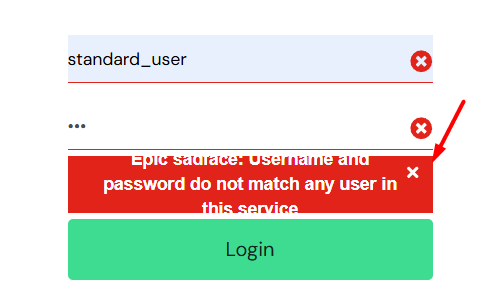

# Bug Reports – SauceDemo

---

## BUG-01 – Error Message Not Specific Enough

**Severity:** Low  
**Priority:** Low  
**Environment:** Chrome, Windows 11

**Steps to Reproduce:**

1. Open login page.
2. Enter valid username.
3. Enter wrong password.
4. Click "Login".

**Expected Result:**  
Specific error message such as "Incorrect password".

**Actual Result:**  
Generic error message is displayed without clear explanation.

**Screenshot:**  

## Notes

- Bugs are documented for demonstration purposes.
- Some issues may be minor UX/UI observations rather than critical defects.
- Screenshots stored in `/manual-tests/screenshots` directory.
